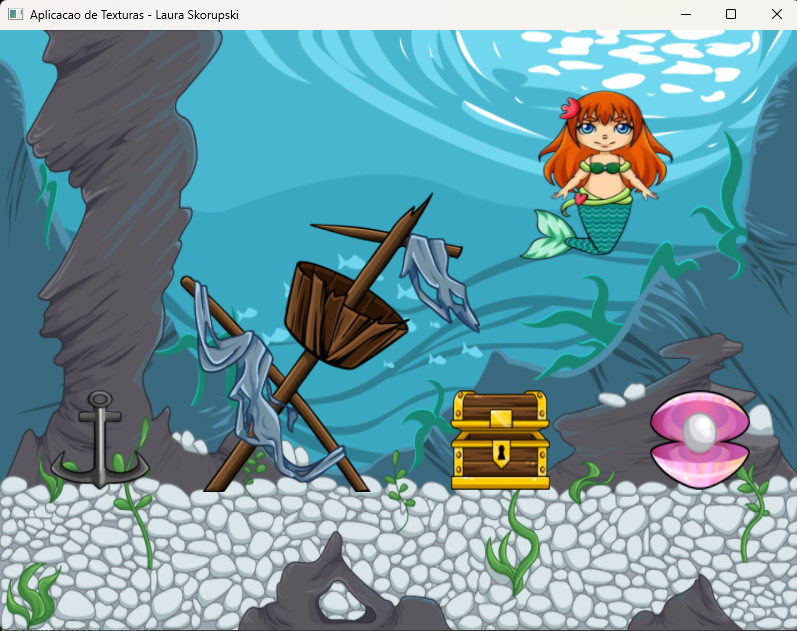

### Aplicação de Texturas

1. **O que esse projeto realiza?**:
   - Este projeto tem como objetivo aplicar os conceitos de aplicação de texturas com OpenGL.
   - Ao executá-lo, ele deverá abrir a seguinte tela:
  
     

2. **Configuração do Ambiente**:
   - Para rodar o projeto é necessário adicionar as bibliotecas utilizadas por ele (disponíveis na pasta Dependencies).
